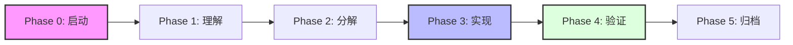

# Blueprint Harness — 业务逻辑驱动型 AI 协同开发框架

> **让 AI Agent 像受过训练的领域专家一样写代码，而不是像没有上下文的代码生成器。**

## 🎯 核心问题

当 AI Agent（Claude、GPT 等）参与复杂业务系统的开发时，最常见的失败模式不是"写不出代码"，而是：

- **业务逻辑凭空捏造**：没有阅读领域模型就开始编写 Service 层
- **文档形同虚设**：文档写了但 Agent 不看，或看了但不引用
- **质量不可追溯**：代码与业务规则之间没有可审计的关联链
- **流程随意跳跃**：跳过设计直接编码，跳过验证直接声明完成

Blueprint Harness 通过**机械化约束**而非"口头建议"来系统性地消除这些问题。

---

## 设计哲学   

本框架的核心理念来自 [Superpowers](https://github.com/deepfates/superpowers) 与 [Trellis](https://github.com/mindfold-ai/Trellis) 项目。通过标准化 Spec 分层与 HARD-GATE 门禁，确保 AI 在可控的轨道内运行：

| 机制 | 来源 | 作用 |
| :--- | :--- | :--- |
| **Enterprise Alignment** | 原创 | **深度适配** `dc-base-template` 与 `dc-framework` 企业级标准 |
| **Iron Laws** | Superpowers | **四条**不可违背的铁律，定义行为底线与不造轮子原则 |
| **HARD-GATE** | 原创 | 六阶段门禁，由 `workflow.md` 强制驱动，消灭"跳步"可能 |
| **Spec Sharding** | Trellis | 将业务知识拆分为高信号的规格说明 (Spec)，提高召回准确度 |
| **Precision Anchor** | 原创 | `@blueprint-ref` 强制代码与蓝图文档建立可追溯链接 |
| **Context Memory** | Trellis | 通过 `workspace/` 留存开发者 Session 日志，解决上下文丢失问题 |
| **Tech Whitelist** | 原创 | `TECH_STACK.md` 强制锁定内部组件，杜绝重复造轮子 |

---

## 🚦 HARD-GATE 工作流 (Phase 0 ~ 5)

本框架强制执行以下六个阶段，每一阶段均有严格的准入与准出准则：



| 阶段 | 核心产出 | 准出关键 (Gate Check) |
| :--- | :--- | :--- |
| **Phase 0** | 业务点识别 | 在对话中列出 1-3 个核心业务锚点。 |
| **Phase 1** | 功能规格书 (Spec) | 产出位于 `harness/tasks/specs/` 下的具名设计文档。 |
| **Phase 2** | 原子任务计划 (Task) | 产出并获批位于 `harness/tasks/active/` 下的具体任务。 |
| **Phase 3** | 业务代码编写 | Java 文件包含 `@blueprint-ref` 锚点且必须通过编译。 |
| **Phase 4** | 机械化验证 | 运行 `validate.py` 提示 **PASS** 且回答“防呆双问”。 |
| **Phase 5** | 知识沉淀 | 任务迁移至 `completed/`，提取经验至 `lessons.md`。 |

---

## 🚀 企业级架构治理红线 (Iron Gates)

本项目不仅是一个协同框架，更是**物理级别的架构执法者**。以下红线由脚本与规格文档强制执行：

### 🔴 API 开发三大禁令 (P0)
1. **禁止使用路径传参 (`@PathVariable`)**：所有参数必须通过 QueryString 或 RequestBody 传递，以配合分布式限流与统一拦截。
2. **禁止使用 `x-www-form-urlencoded`**：API 交互必须且只能使用 `application/json`。
3. **强制 URL 中划线命名**：资源与动作路径必须使用中划线（kebab-case），如 `/create-user`，禁止使用驼峰命名。

### 🟡 统一交互规约 (Standards)
- **分页规范**：强制继承 `BasePageParam`，返回 `ApiResult<PageResult<VO>>`，参数锁定为 `current/size`。
- **响应包装**：所有接口必须统一封装在 `ApiResult<T>` 中。
- **异常处理**：业务逻辑异常必须通过 `BusinessException` 抛出，严禁返回非标错误对象。

---

## 快速开始

### 1. 复制到你的项目

```bash
# 将 harness/ 目录和 AGENT.md 复制到你的业务项目根目录
cp -r blueprintharness/harness your-project/
cp blueprintharness/AGENT.md your-project/
```

### 2. 填充你的业务蓝图 (Specs)

按照以下顺序编辑 `harness/spec/` 下的模板文件，确保其与 `dc-framework` 规范对齐：

```
TECH_STACK.md    →  技术栈锁死 (Java 17 / Spring Boot 3 / MP 3.5.11)
       ↓
PRODUCT_SENSE.md  →  业务背景与目标驱动
       ↓
DOMAIN_MODEL.md   →  核心实体 (含 deleted 字段)、业务规则与状态机
       ↓
BUSINESS_PROCESS.md → 业务流程、时序与异常补偿
       ↓
ARCHITECTURE.md   →  物理模块规范 (start/module) 与 API 红线治理
       ↓
VERIFY.md         →  验收标准与物理门禁脚本说明
```

### 3. 开始协作

当你在项目根目录放置了 `AGENT.md` 后，AI 将自动加载 **Phase 0 → Phase 5** 的门禁流程。详细规则见 `harness/workflow.md`。

---

## 项目结构

```
your-project/
├── AGENT.md                              # 🔴 Agent 行为宪法（启动后第一个读的文件）
│
└── harness/
    ├── workflow.md                       # 📜 任务执行工作流（HARD-GATE 定义）
    │
    ├── spec/                             # 📘 业务规格库 (Specs) — "事实唯一来源"
    │   ├── README.md                     #    文档导航图与阅读顺序
    │   ├── TECH_STACK.md                #    技术栈锁死与组件白名单 (dc-framework)
    │   ├── DOMAIN_MODEL.md              #    核心实体 (含逻辑删除)、规则 (BR-xxx)、状态机
    │   ├── BUSINESS_PROCESS.md          #    业务流程、时序、异常补偿
    │   ├── PRODUCT_SENSE.md             #    业务背景、价值、风险
    │   ├── ARCHITECTURE.md              #    多模块 Maven 规范、API 红线、分页/结果规约
    │   └── VERIFY.md                    #    验收清单与物理校验门禁 (validate.py)
    │
    ├── tasks/                            # 📋 任务调度中心
    │   ├── specs/                        #    功能规格书 (Task PRDs，含 API 规格自查项)
    │   ├── active/                       #    进行中的原子任务
    │   └── completed/                    #    已闭环归档的任务
    │
    ├── workspace/                        # 🧠 开发工作区（Session Journals）
    │   └── [user]/                       #    每个开发者的会话持续性记录
    │
    ├── scripts/                          # ⚙️ 机械化执法
    │   ├── validate.py                  #    ✅ 推荐：单体跨平台 Python 校验脚本
    │   ├── validate.ps1                 #    Legacy：Windows PowerShell 验证脚本
    │   └── validate.sh                  #    Legacy：Linux/macOS Bash 验证脚本
    │
    ├── trace/                            # 🔍 失败审计
    │   └── failures.md                  #    架构违规与偏差教训记录
    │
    └── memory/                           # 🧠 经验沉淀
        └── lessons.md                   #    可复用的业务代码模式库
```

---

## 核心机制详解

### 🎯 `@blueprint-ref` — 精确锚点引用

每一段业务代码上方必须包含对蓝图文档的显式引用：

```java
// @blueprint-ref: DOMAIN_MODEL BR-002 支付前必须校验库存
public void processPayment(Order order) {
    if (!inventoryService.checkStock(order)) {
        throw new InsufficientStockException();
    }
    // ...
}
```

### 🧠 Workspace Journals — 解决上下文丢失

在 `harness/workspace/[user]/journal.md` 中，AI 会记录复杂的决策逻辑或技术选型背景。这确保了当另一名同事或下一个 AI Session 接入时，能够快速“对齐”思路。

---

## 验证脚本 (Iron Gate)

验证脚本包含五个探针（Probe 0 ~ 4），它是保证代码不偏离蓝图的最后一道物理防线：

| Probe | 检查内容 | 失败后果 |
| :--- | :--- | :--- |
| **Probe 0** | 环境锁死检查 (必须包含 `pom.xml` 及 `dc-framework` 或 `dc-biz` 依赖) | ❌ CRITICAL FAIL |
| **Probe 1** | Git 暂存区检查 (每一个 Java 文件必须包含有效的 `@blueprint-ref` 锚点) | ❌ FAIL |
| **Probe 2** | 核心规格完整性 (确认 7 个核心 `spec/` 文档未被移除) | ❌ FAIL |
| **Probe 3** | 防呆双问校验 (检查活跃任务的“收尾反思”是否已真实填写而非保留占位符) | ⚠️ WARN |
| **Probe 4** | 格式与自愈 (运行 `mvn spring-javaformat` 校验并执行自动修复) | ⚠️ SELF-HEAL |

### 运行方式

```bash
# 推荐方式 (跨平台交互式)
python harness/scripts/validate.py

# Legacy 方式
powershell -ExecutionPolicy Bypass -File harness/scripts/validate.ps1
bash harness/scripts/validate.sh
```

---

## 💡 最佳实践 (Pro Tips)

1. **分而治之**：单次原子任务（Active Task）的规模应控制在总工作量的 **1/5** 以内，确保 AI 不会有 Context 过载风险。
2. **先文档后代码**：永远先在 `spec/` 下看懂/增加模型，再写任务规格书，最后再动手编码。
3. **精准引用**：在代码中使用 `// @blueprint-ref: [文档名] [规则编号]` 来建立不可辩驳的上下文锚点。

---

## License

MIT

---

## 致谢

- [Superpowers](https://github.com/deepfates/superpowers) — Iron Laws、Red Flags 等行为塑造模式的灵感来源
- [Trellis](https://github.com/mindfold-ai/Trellis) — Spec 分层、Workspace Journaling 等工程化设计的参考
