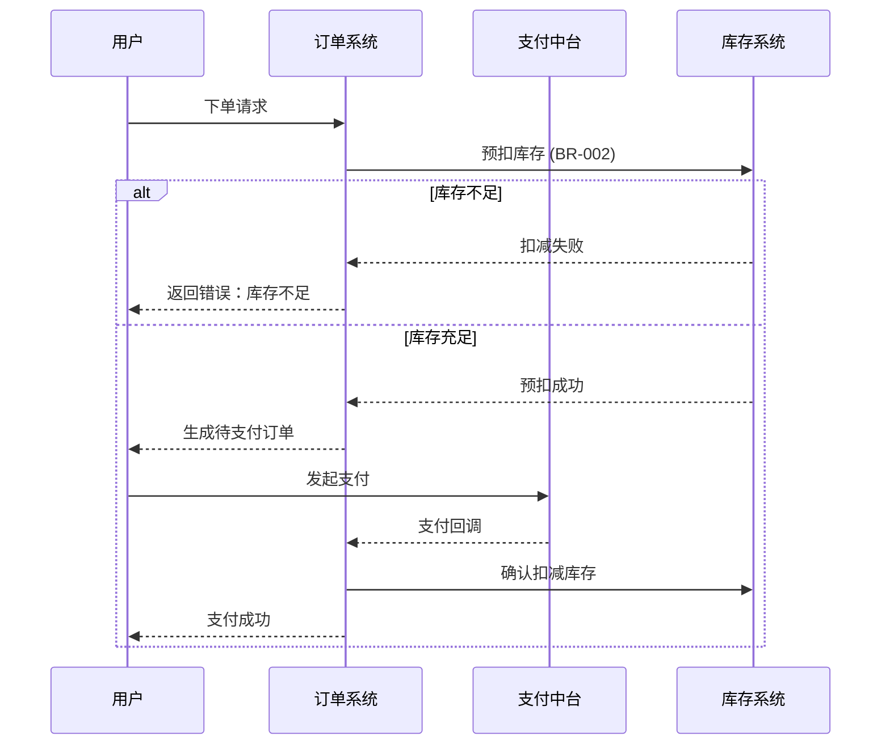

# 核心资产：业务流程 (BUSINESS_PROCESS.md)

> 文档权威等级：P1
> 本文档定义了业务时序、外部协作及异常补偿逻辑。

## 1. 核心时序图 (Sequence Diagram)

必须包含**成功路径**和**典型失败路径**。

---

## 2. 状态扭转矩阵 (State Matrix)

| 当前状态 | 触发事件 | 目标状态 | 业务逻辑/约束 |
| :--- | :--- | :--- | :--- |
| `PENDING` | `PAY_SUCCESS` | `PAID` | 必须确认支付金额与订单金额一致。 |
| `PENDING` | `PAY_TIMEOUT` | `CANCELLED` | 释放预扣库存（Anchor-StockRelease）。 |
| `SHIPPING` | `USER_CONFIRM` | `COMPLETED` | 结算相关费用。 |

---

## 3. 异常处理与补偿策略

| 异常场景 | 影响范围 | 补偿动作 |
| :--- | :--- | :--- |
| 支付超时但已扣款 | 金融差错 | 触发异步退款流程 + 记录异常日志。 |
| 库存预扣成功但订单取消 | 数据孤岛 | 触发库存释放补丁（Job-StockClean）。 |
| 回调通知丢失 | 流程中断 | 主动查询支付网关状态。 |
