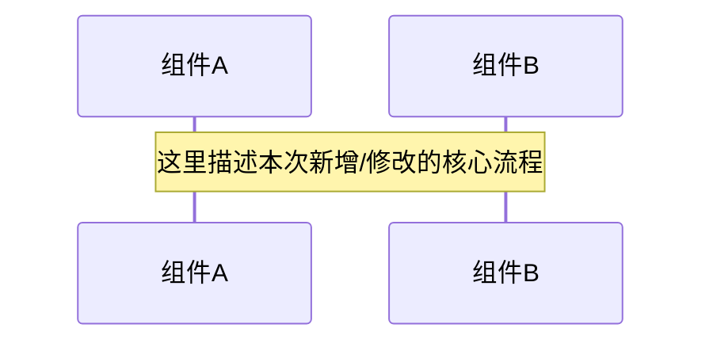

# [功能名称] 设计规格书 (TEMPLATE)

> 创建日期: YYYY-MM-DD
> 版本: v1 (Initial) | Revision: 0
> 所属模块: 订单 / 支付 / 营销 / ...
> 状态: Draft

## 1. 业务背景与目标 (Why)
- **驱动源**: 引用 `PRODUCT_SENSE.md` 中的具体场景。
- **目标**: 能够解决业务中的什么具体问题。
- **边界**: 本次 Spec 不包含哪些内容（防止 Scope Creep）。

## 2. 领域模型映射 (What)
> 参考 `DOMAIN_MODEL.md`。

- [ ] **新增实体**: (若有，需在此定义属性)
- [ ] **状态机变更**: (若涉及状态扭转，请使用 Mermaid 画出变更后的片段)
- [ ] **规则引用**: 引用已有的规则编号（如 `BR-001`）或在此定义新规则。

## 3. 业务流程设计 (How)
> 参考 `BUSINESS_PROCESS.md`。

## 4. 验收准则 (Acceptance Criteria)
> 必须是二进制（Passed/Failed）可测量的。

- [ ] AC-1: [描述触发条件 + 期望结果]
- [ ] AC-2: [描述触发条件 + 期望结果]

## 5. 变更影响分析 (Impact Analysis)
> 强制性同步检查，任何业务文档的修改必须伴随波及分析。

- [ ] **DOMAIN_MODEL.md** 需要同步更新？
- [ ] **BUSINESS_PROCESS.md** 需要同步更新？
- [ ] **VERIFY.md** 验收清单需要新增？
- [ ] **ARCHITECTURE.md** 是否有分层破坏？
