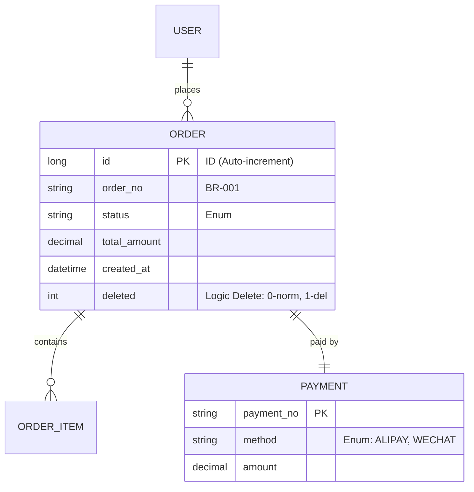
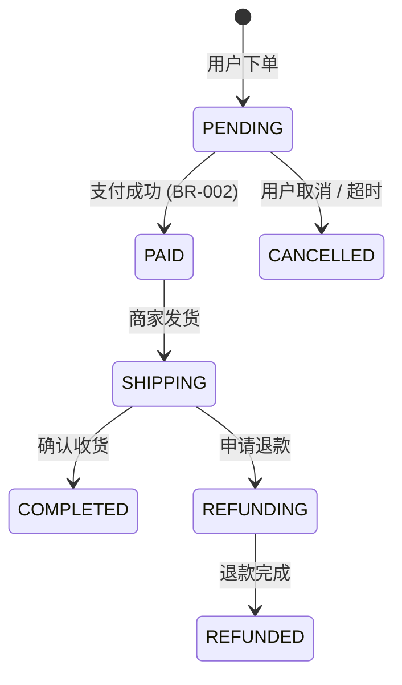

# 核心资产：领域模型 (DOMAIN_MODEL.md)

> 文档权威等级：P0 (最高)
> 本文档定义了业务的核心实体、状态枚举及硬性约束。

## 1. 实体关系图 (ER Diagram)

使用 Mermaid 描述核心对象及其关联。

---

## 2. 核心状态机 (State Machine)

描述业务对象的生命周期流转。

---

## 3. 全局业务规则 (Business Rules)

| 编号 | 规则描述 | 锚点 ID |
| :--- | :--- | :--- |
| **BR-001** | 订单号生成规则：`ORD` + 时间戳 + 4位随机码。 | `Anchor-OrderNo` |
| **BR-002** | 支付前必须校验库存，若库存不足则状态流转失败。 | `Anchor-PayCheck` |
| **BR-003** | 订单总价不得为负数。 | `Anchor-AmountCheck` |

---

## 4. 值对象定义 (Value Objects)

- **Money**: 包含金额（Decimal）和币种（Currency）。
- **Address**: 包含省、市、区、详细地址、邮编。
