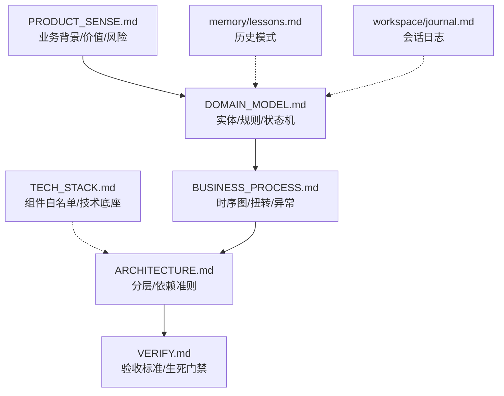

# 规格说明库导航 (Harness Specs)

> 本目录存放业务开发的“事实来源”。所有逻辑变更必须先在此处建立资产，方可进入编码环节。

## 1. 文档依赖与阅读顺序 (Phase 0 引导)

建议在开始新特性前，按照以下箭头顺序进行“召回式阅读”：

---

## 2. 资产说明

| 文档 | 核心内容 | 维护原则 |
| :--- | :--- | :--- |
| **TECH_STACK** | 解决“用什么工具”的问题。 | 核心权威资产。任何组件引入必须先核对白名单。 |
| **PRODUCT_SENSE** | 解决“为什么做”的问题。 | 变更需评估对原有业务价值的波及。 |
| **DOMAIN_MODEL** | 解决“抽象成什么”的问题。 | 核心权威资产。任何字段/状态变更必须更新此文。 |
| **BUSINESS_PROCESS** | 解决“如何协作”的问题。 | 必须包含由 `DOMAIN_MODEL` 定义的状态扭转。 |
| **ARCHITECTURE** | 解决“代码位置”的问题。 | 严禁跨层调用，严禁反向依赖。 |
| **VERIFY** | 解决“如何算完”的问题。 | 所有 AC (验收准则) 必须能在此找到归属。 |

---

## 3. 维护铁律

- **同步更新**：文档与规格书 (Tasks/Specs) 必须保持同步。禁止出现“文档描述 A，代码实现 B”的情况。
- **锚点唯一**：在代码中使用 `@blueprint-ref` 引用文档时，确保锚点 ID 是唯一的。
- **会话回滚**：当 `workspace/` 中的日志发现蓝图缺失时，必须在当前 Task 结束前补库。
