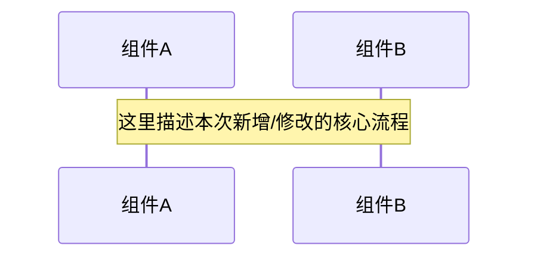

# [功能名称] 设计规格书 (TEMPLATE)

> 创建日期: YYYY-MM-DD
> 版本: v1 (Initial) | Revision: 0
> 所属模块: 订单 / 支付 / 营销 / ...
> 状态: Draft

## 1. 业务背景与目标 (Why)
- **驱动源**: 引用 `harness/spec/PRODUCT_SENSE.md` 中的具体场景。
- **目标**: 能够解决业务中的什么具体问题。
- **边界**: 本次 Spec 不包含哪些内容（防止 Scope Creep）。

## 2. 领域模型映射 (What)
> 参考 `harness/spec/DOMAIN_MODEL.md`。

- [ ] **新增实体**: (若有，需在此定义属性)
- [ ] **状态机变更**: (若涉及状态扭转，请使用 Mermaid 画出变更后的片段)
- [ ] **规则引用**: 引用已有的规则编号（如 `BR-001`）或在此定义新规则。

## 3. 业务流程设计 (How)
> 参考 `harness/spec/BUSINESS_PROCESS.md`。

## 4. 验收准则 (Acceptance Criteria)
> 必须是二进制（Passed/Failed）可测量的。

- [ ] AC-1: [描述触发条件 + 期望结果]
- [ ] AC-2: [描述触发条件 + 期望结果]

## 5. 变更影响分析 (Impact Analysis)
> 强制性同步检查，确保不重复造轮子且蓝图一致。

- [ ] **harness/spec/DOMAIN_MODEL.md** 需要同步更新？
- [ ] **harness/spec/BUSINESS_PROCESS.md** 需要同步更新？
- [ ] **harness/spec/VERIFY.md** 验收清单需要新增？
- [ ] **harness/spec/ARCHITECTURE.md** 是否有分层破坏？
- [ ] **组件对齐对标**: 是否已查阅 `TECH_STACK.md` 并使用了对应的 `dc-spring-boot-starter-*`？
- [ ] **API 规范红线校验**: 
    - [ ] 严禁 `@PathVariable` (使用 Query/Body 替代)
    - [ ] 严禁 `x-www-urlencoded` (使用 JSON)
    - [ ] 资源/动作命名是否已使用中划线 (如 `/delete-user`)
    - [ ] 是否已包含逻辑删除字段 `deleted`
    - [ ] 主键是否已设置为数据库自增 (Auto-increment)
    - [ ] 分页是否对齐 dc-framework PageResult 规范 (current/size 参数)
    - [ ] 响应结果是否统一使用 `ApiResult<T>` 封装
    - [ ] 业务报错是否统一使用 `BusinessException` 抛出并指定响应码 (ResultCode)专用。
